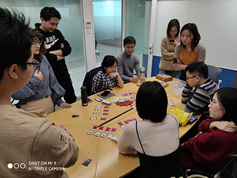
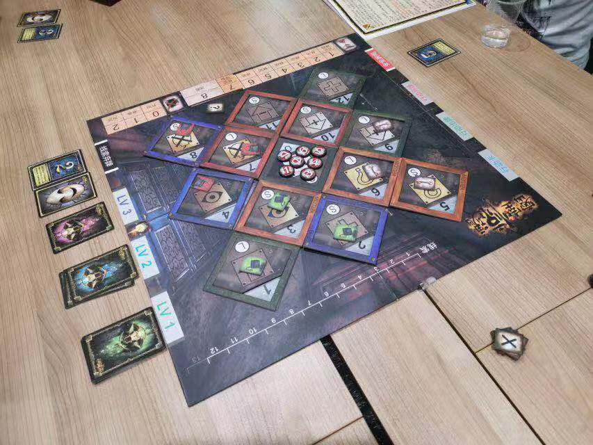

参加了两个月的桌游社活动，大概有8次，玩过的桌游大概有20多种，罗列一下令我印象深刻的桌游吧 
 
			阿瓦隆
 
			卡卡颂
	 
			密室逃脱
 
	        ..... 
 
	才列举了两个，发现其他名字都记不清了。。
 
	还是放一些以往的图片来回顾一下吧 
 
	
	   
	最近的一次，《犯罪现场》，解谜类，打开脑洞补充剧情，还是很有意思的。
	   
	
		  
	这是《僵尸围城》剧照，语言类，比较考验人性，还是很有意思的。
	   
	 
	  
		  
	这是《密室逃脱》剧照，益智道具解谜类，道具做工精良，还是很有意思的。
	   
	突然发现能找到的照片也就这些了。。
	
	  
 看完我的介绍，是不是对桌游社的活动充满期待呢~ 